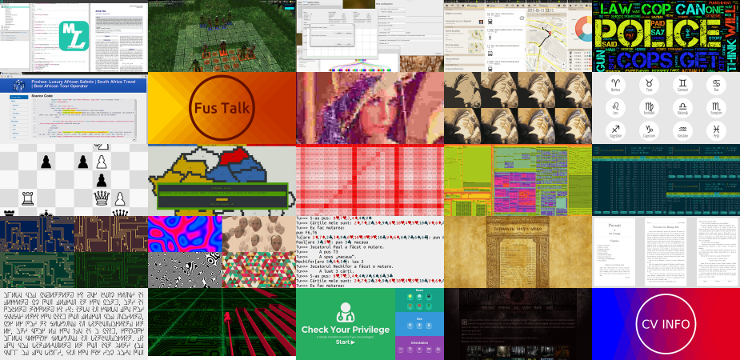

# Nechifor Site

The Node app that joins all my other [Intercessor][ic] apps.

## Apps

Source code of the apps that are used:

* [chess-puzzles](https://github.com/paul-nechifor/chess-puzzles)
* [circuits](https://github.com/paul-nechifor/circuits)
* [git-visualization](https://github.com/paul-nechifor/git-visualization)
* [horoscop](https://github.com/paul-nechifor/horoscop)
* [identitate-falsa](https://github.com/paul-nechifor/identitate-falsa)
* [intercessor-example](https://github.com/paul-nechifor/intercessor-example)
* [jpeg-enricher](https://github.com/paul-nechifor/jpeg-enricher)
* [nechifor-blog](https://github.com/paul-nechifor/nechifor-blog)
* [nechifor-index](https://github.com/paul-nechifor/nechifor-index)
* [papers](https://github.com/paul-nechifor/papers)
* [pseudoromanian](https://github.com/paul-nechifor/pseudoromanian)
* [sibf](https://github.com/paul-nechifor/sibf)
* [sidrem](https://github.com/paul-nechifor/sidrem)
* [webgl-demos](https://github.com/paul-nechifor/webgl-demos)

## Usage

Download all the requirements (it will take a while):

    npm run prepare

Build it:

    npm run build

Run it:

    npm run start

## License

MIT

[ic]: https://github.com/paul-nechifor/intercessor
